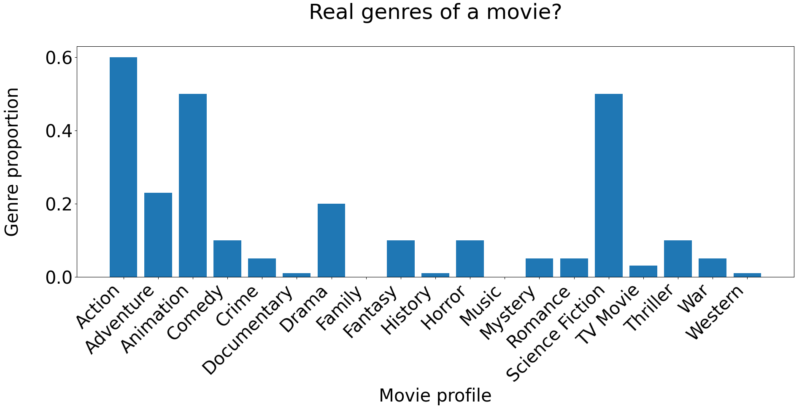

# Table of contents
- [Table of contents](#table-of-contents)
- [Description](#description)
- [How to?](#how-to)
- [Project structure](#project-structure)
- [Setup anaconda environment for using GPU under Windows](#setup-anaconda-environment-for-using-gpu-under-windows)
- [Commands for building anaconda environment under Windows](#commands-for-building-anaconda-environment-under-windows)
- [Code documentation](#code-documentation)

# Description
Watch Tip is a recommendation engine currently exclusive for movies.

# How to?
This recommendation engine is based on the psychological aspect that people are watching always the same king of movies and actors playing always the smae kind of movies, same for producers. 
To make this aspect useful and create an AI learning from these patterns, the "real genres" (the real contents of a movie) of movies of will be computed. These will be done by counting in which genres (per movie) an actor has played, a producer has produced and a company has financed. Normalize it and you know the real content of a movie. 
The second step is to sort the proposed content based matching movies by another AI e.g. sentimal analysis. So we evaluate not only the users' votings. We also take the reviews into account!
The UI is coming soon.

# Project structure
WATCH-TIP 
├── [data_preprocessing](data_preprocessing/README.md) - Preprocess data
├── database - Interaction with database (create, read update delete) 
├── docs - Some documentation about the project 
├── helper - Helper files with some helpful functions etc. 
├── [model](model/README.md) - Implementation/Usages of AI techniques/models to predict the real genres of the next movie or the next movie itself 
├── ranking - Rank proposed/suggested movies (from AIs from directory model) to show the best at first 
├── slides-decks - Slides and presentations 
├── tests- Tests ensuring quality of several modules 
├── webserver - Contains not fully implemented UI --> coming soon

# Setup anaconda environment for using GPU under Windows
Necessary packages:
- python=3
- numba
- cudnn
- nvidia::cuda-cupti
- cudatoolkit=10.1.243

# Commands for building anaconda environment under Windows
conda create --name kint python=3 pymongo pandas numba numpy matplotlib plotly pathlib scipy seaborn statsmodels numba scikit-learn cudnn nvidia::cuda-cupti cudatoolkit=10.1.243 word2vec gensim 
conda activate kint 
python -m pip install "tensorflow<2.11" 
conda install conda-forge::multicore-tsne

# Code documentation
The code documentation is written with the numpy-style: [Numpy-Style](https://numpydoc.readthedocs.io/en/latest/format.html) 
There are also some diagrams representing the runtime behaviour of the files/algorithms. See for this in the "docs" directory.
