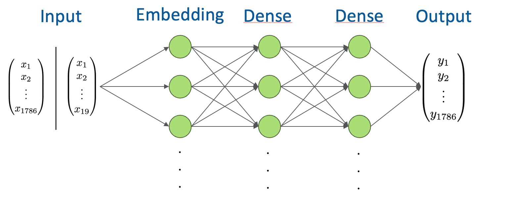

# Model behaviour
The model uses movies to lean the context of each movie, so which movies a user may watch next time. 
So the grounded truth looks like the following: 
**movie (= target) --> some more or less similiar movies (= context)**

# Model structure
The used model has the following structure: 
The input dimension depends whether one hot encoding was used (1x1786, because 1786 movies were used and each movie must be watched more than 10,000 times) or not (1x19 standing for the real genres).

# Evaluation
The results of the model are stored in the directories laying in the current/this directory. 
First of all there are problems using sparse vectors with TensorFlow, so not all embeddings can be tested without good hardware. A working example is coming soon. 
The current results are independent from the used embedding or the layers and their parameterizations: 
- Probability for movies lay between 0.4 % and >0 %
- Accuracy lays between 0.2 and 0.7 % + often overfitting after 5-6 epochs
- The genres of the proposed movies match to the predefined genres with 1.3 %
- The genres of the proposed movies match to the relal genres with 2 %
- The mean deviation of real genres is above 1
