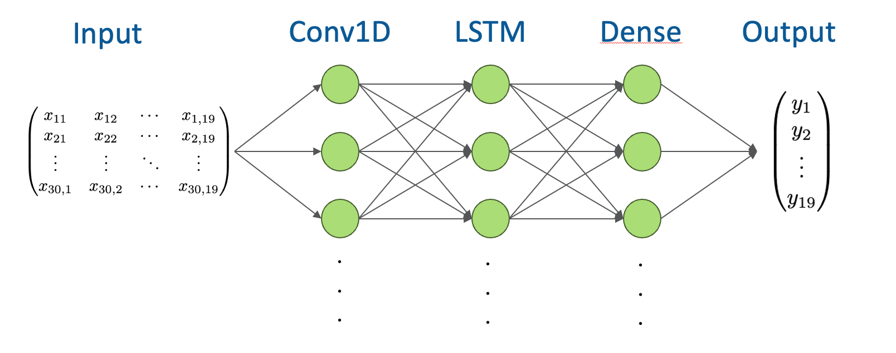
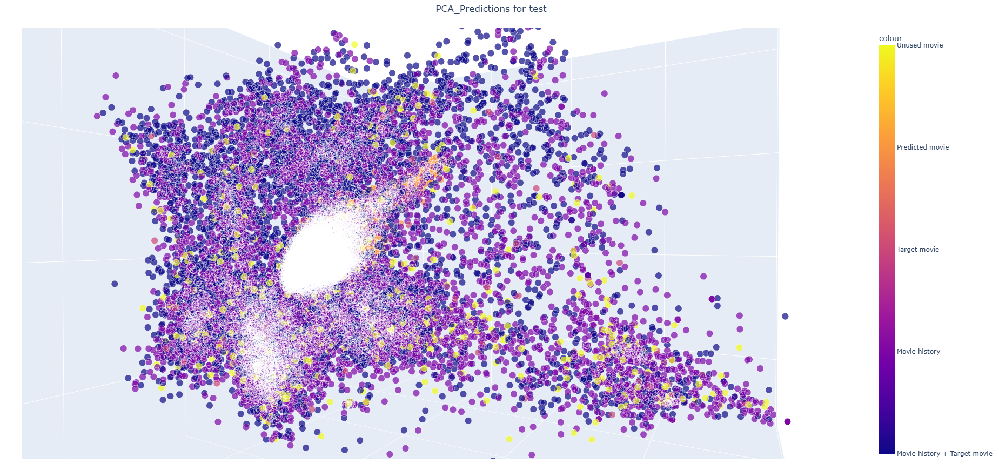
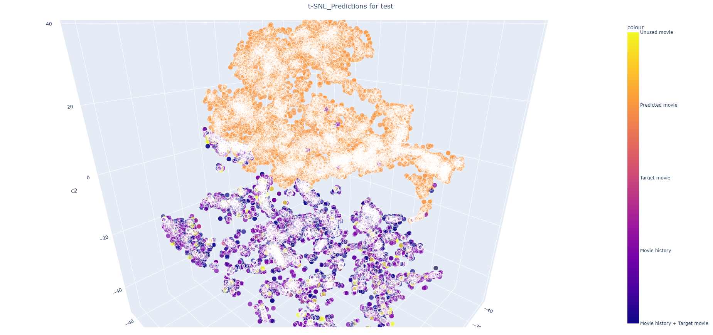

# Model behaviour
The model uses the a user's last n movies as movie history and predicts the next movie, which a user will watch. 
So the grounded truth looks like the following: 
**movie history (= context) --> next movie (= target)**

# Model structure
The used model has the following structure: 
The input dimension depends on the number of hstories used to predict the next movie (10x19 for 10 movies in history, 30x19 for 30 movies in history and 100x19 for 100 movies in history).

# Evaluation
The results of the model are stored in the directories laying in the current/this directory. 
The accuracy of the model can be displayed with PCA:

The plot shows the predictions (orange) to the test data, the movies which were only used as target (rosa), the movies which were only used in the movie history (= context, puple), the movies which were used as target and in history (blue) and the movies, which weren't used for testing at all (yellow.) 
In the plot, you can see that the variance in the data is too high and and that the model can only predict the values around the mean values/real genres (orange points). So the amount of different data is too big. An improvement could be, reducing the amount of variance by splitting the data into different parts (coming soon). 
It's also possible to visualize the data with t-SNE:

Now you can see that the predictions are far away from the real values more than the ones computed with PCA. This happens, because t-SNE reduces the data with non linear transofrmations. So it takes only the neighbours with probability distributions into account, so that different figures origins, because there are many more predictions than targets. 
Overall PCA shows the correct figure/accuracy.

# Model parameterizations
The file [Progress](progress.txt) contains different parameterizations with different layers of the described model/variants of the model.